# 10分钟学会pillow图像处理16式


PIL：Python Imaging Library，是Python环境下最受欢迎的图像处理库，木有之一。

pillow简单优雅而功能强大，是图像相关机器学习任务中tensorflow和pytorch的亲密合作伙伴。

我们将介绍pillow的如下16个图片处理功能。

1, 图片读写

2, 图片与array互转

3, 图片与string互转

4, 图片由彩色转灰度

5, 图片通道分离与合并

6, 调整图片尺寸

7, 截取图片部分区域

8, 图片旋转

9, 图片翻转

10, 提取图片边缘

11, 图片高斯模糊

12, 在图片上绘制文字

13, 在图片上绘制直线

14, 在图片上绘制矩形

15, 在图片上绘制椭圆

16, 在图片上粘贴其他图片


安装pillow非常简单。

```
pip install pillow
```


### 一，图片读写

```python
import numpy as np 
from PIL import Image,ImageFilter,ImageDraw,ImageFont
```

```python
# 读取图片
img = Image.open("./data/猫咪图片.jpg")
print(img.format, img.size, img.mode)
print(img.info)
img 
```

```
JPEG (641, 641) RGB
{'jfif': 257, 'jfif_version': (1, 1), 'dpi': (72, 72), 'jfif_unit': 1, 'jfif_density': (72, 72)}
```


```python
# 保存图片
img.save("./data/猫咪图片.png") 
```

```python

```

### 二，图片与array互转

```python
# Image转np.array
img = Image.open("./data/猫咪图片.jpg")
arr = np.array(img)
print(arr.shape)  
print(arr.dtype)
```

```
(641, 641, 3)
uint8
```

```python
# np.array转Image

arr = (np.ones((256,256))*np.arange(0,256)).astype(np.uint8)
img = Image.fromarray(arr)
img 
```

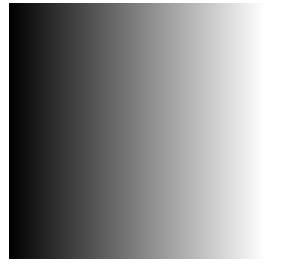


### 三，图片与string互转

```python
# Image转string 

import base64
from io import BytesIO

img = Image.open("./data/猫咪图片.jpg")
buffer = BytesIO()
img.save(buffer, 'PNG')
b = buffer.getvalue()
s = base64.b64encode(b).decode("utf-8") 

print(s[0:1000])
```

```
iVBORw0KGgoAAAANSUhEUgAAAoEAAAKBCAIAAACnMebvAAEAAElEQVR4nOz96bMtSXIfiLl7ROR2lru+raqrqxsEQBAkRuKMRHI0kj6OSTLJ9M+KRumTTJwxyWZGJm6DIQguAHqp7lree3c5S2ZGhLs+eIbfOOe+V13dKGxjCHt27b5z82RGRnj4z3fHT69fJB3CiEhEDCIi5H1KKQt775umEYRpmsZx/PGnn3Vd94tf/OLu7u7y8lJExnG8uro6Ho/ee+ccMwNA13UXFxebzeZnP/uZcw4R53k+Ho/TNIkIIiIiMxMREaWUcs6bzebm5mae5/1+H2NsmiaEkHOe55mZvfcAkFKa5xkA9OL1er3ebv/oj/7IOSciOUbv/cPDAwr0fb/uh5ubmxDCeDgi4vF4/NnPfjYHBAAsQ38HgJxzSklEiAgARKRt22EYmqaZpul4PM7zbDMXEfgbMnSqurP2EwDGcaz/axf/DXq1aZq6rgMAEfmd3/mdm5ubn/3sZz//+c9TSgCgJCEiIYS+7+d5nqYp5+y9R8Scs4g45z5287NdtrUaOdknKICIZNfI8tOWlABczuv1uuu6lNI0TXo6mFkncHZ/AEhxdM7ps5TenHPOuZTSarXquo6Z7eAw80wZAHJMMUZP5L3PMY2Ho3Nuu1oPfS8iHJOIcMoxRiYnIjlnvQ8UCsk5O+dCCCEEXRb9PMWdnt+cc4wx50xEeuXxeBSRYRj6vnfO6XmJhwcqQ99UxzAMIqK/1y8ukpUVzPOsR7tt26ZphmGwZdEn6jQaDHoHRBTCnPM4juM89X2/Px6dcxcXF74JMcYQwna7TeCULyknSSkhovfezoWus1F+hFnXvGmapml0bjlnKIxCr0TEEIL3fjelpml0xexk7ff74/GoX1TmZqv9W3/3d66vr5l5HMfNsOr7npkJMMYoOSsnzjEpt5znOca42+2Ucg6HwzzPV1dXn3766YsXL0IIXdc1TQMA8zyP4xhj
```

```python
# string转Image 

b = base64.b64decode(s.encode("utf-8")) 
buffer = BytesIO(b) 
img = Image.open(buffer)
img 
```


### 四，图片由彩色转灰度

```python
# 转成灰度
img = Image.open("./data/猫咪图片.jpg")
img.convert("L")
```

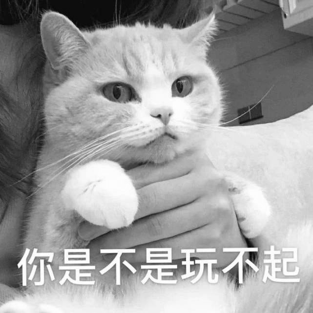

```python

```

### 五，图片通道分离与合并

```python
# 分离通道
img = Image.open("./data/猫咪图片.jpg")
r,g,b = img.split() 
b 
```

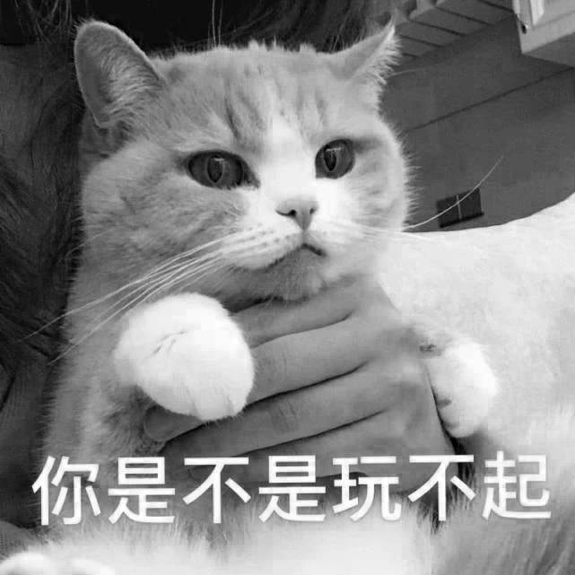

```python
# 合并通道
Image.merge(mode = "RGBA", bands = [r,g,b,r])
```

```python

```

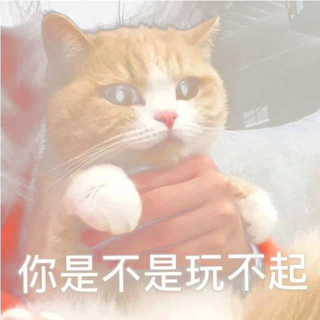


### 六， 调整图片尺寸

```python
# 调整大小
img = Image.open("./data/猫咪图片.jpg")
print(img.size)
img_resized = img.resize((300,300))
print(img_resized.size)
img_resized 
```

```
(641, 641)
(300, 300)
```

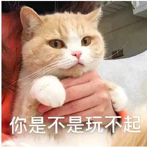

```python

```

### 七， 截取图片部分区域

```python
img = Image.open("./data/猫咪图片.jpg")
img_croped = img.crop(box = [78,24,455,320]) 
print(img_croped.size)
img_croped
```

```
(377, 296)
```

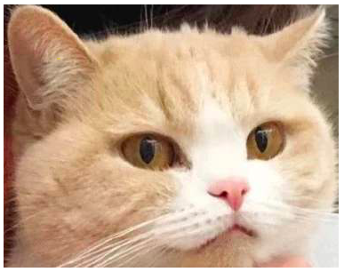

```python

```

```python

```

### 八,  图片旋转

```python
img = Image.open("./data/猫咪图片.jpg")
img_rotated = img.rotate(15,center = (0,0)) #以center为中心逆时针旋转
img_rotated
```

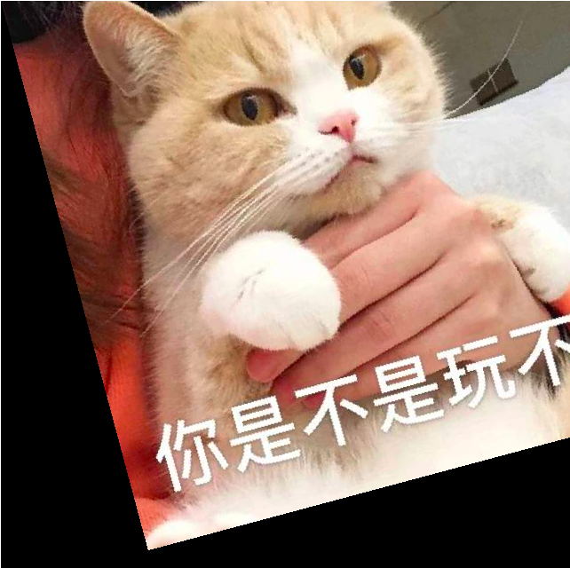

```python

```

### 九, 图片翻转

```python
img = Image.open("./data/猫咪图片.jpg")

# 左右翻转
img_left_right = img.transpose(Image.FLIP_LEFT_RIGHT)
img_left_right 

```

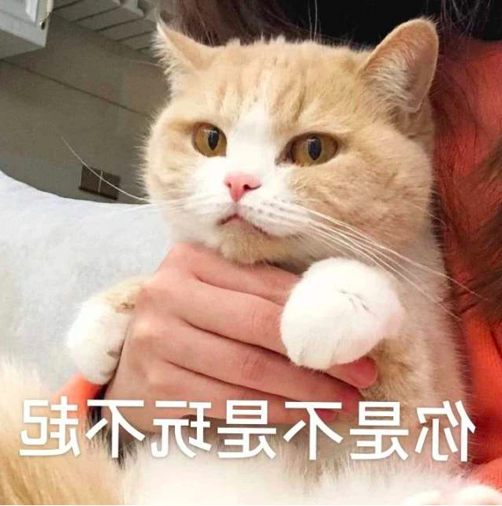

```python
# 上下翻转
img_top_bottom = img.transpose(Image.FLIP_TOP_BOTTOM)
img_top_bottom
```

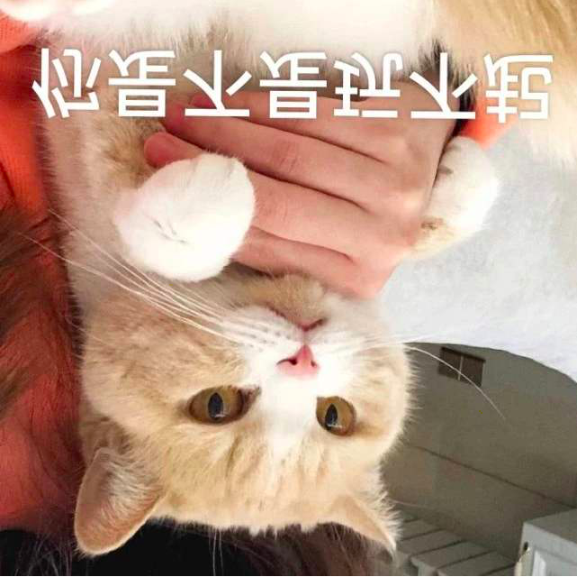

```python

```

### 十, 提取图片边缘

```python
img = Image.open("./data/猫咪图片.jpg")

img_edges = img.filter(ImageFilter.FIND_EDGES)
img_edges 
```

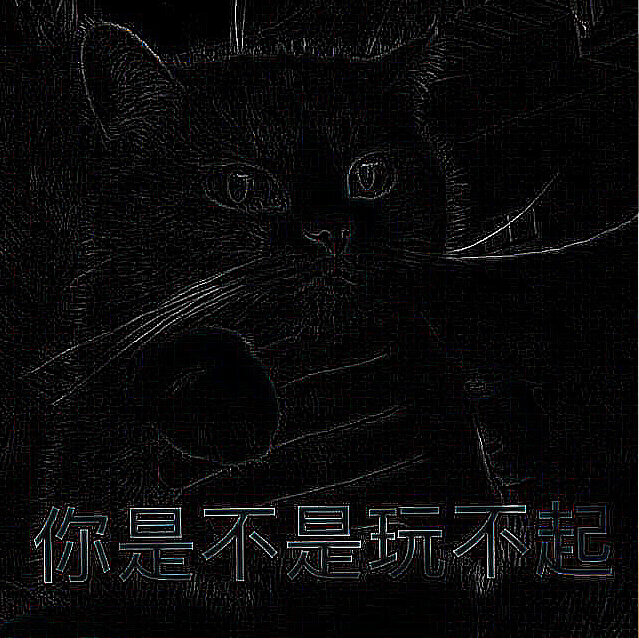

```python

```

```python

```

### 十一, 图片高斯模糊

```python
img = Image.open("./data/猫咪图片.jpg")
img_blur = img.filter(ImageFilter.GaussianBlur(radius=3))
img_blur 
```


```python

```

```python

```

```python

```

### 十二, 在图片上绘制文字

```python
img = Image.open("./data/猫咪图片.jpg")
draw = ImageDraw.Draw(img)
arial = ImageFont.truetype('./data/simsun.ttc', 46)
draw.text((250,450),"敢梭哈吗?",font =arial, fill="white")
img
```


```python

```

### 十三, 在图片上绘制直线

```python
img = Image.open("./data/猫咪图片.jpg")
draw = ImageDraw.Draw(img)

draw.line([0,0,641,641],fill = "red",width = 5)
img
```

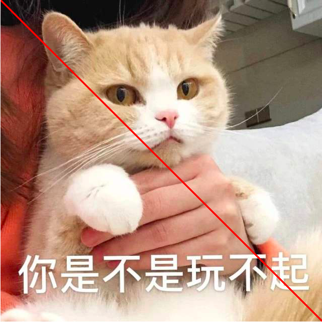


```python

```

### 十四, 在图片上绘制矩形

```python
img = Image.open("./data/猫咪图片.jpg")
draw = ImageDraw.Draw(img)

draw.rectangle([78,24,455,320], fill=None, outline ='lawngreen',width = 5)
img
```

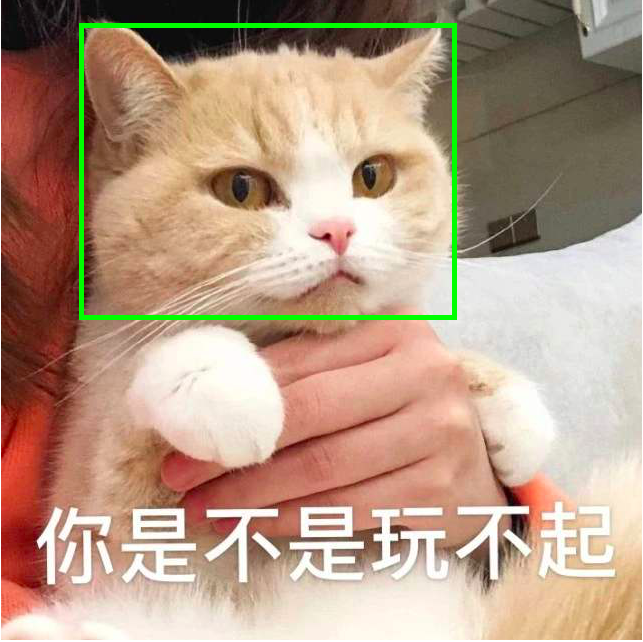

```python

```

### 十五, 在图片上绘制椭圆

```python
img = Image.open("./data/猫咪图片.jpg")
draw = ImageDraw.Draw(img)
draw.arc(xy = [78,24,455,320],start = 0,end = 360,fill="red",width=5)
img

```

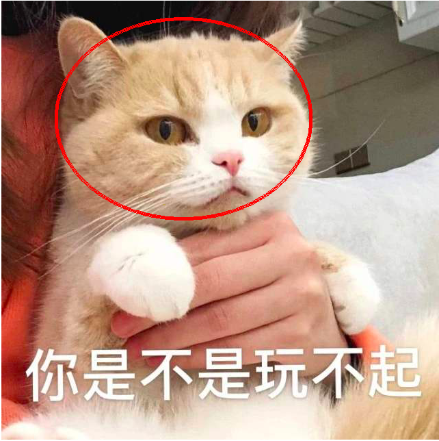

```python

```

### 十六, 在图片上粘贴其他图片

```python
img = Image.open("./data/猫咪图片.jpg")
img_resized = img.resize((150,150))
img.paste(img_resized,box = [460,50])
img
```

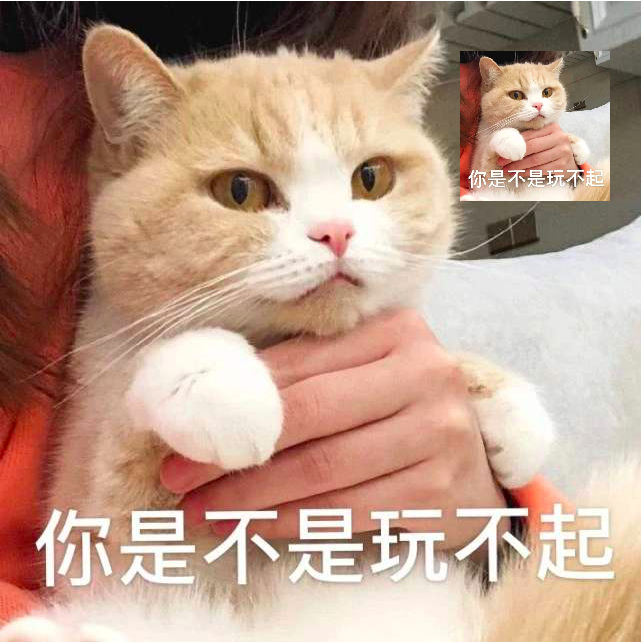


如果对本文内容理解上有需要进一步和作者交流的地方，欢迎在公众号"Python与算法之美"下留言。作者时间和精力有限，会酌情予以回复。

也可以在公众号后台回复关键字：加群，加入读者交流群和大家讨论。


```python

```
