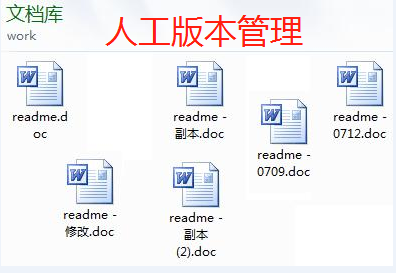
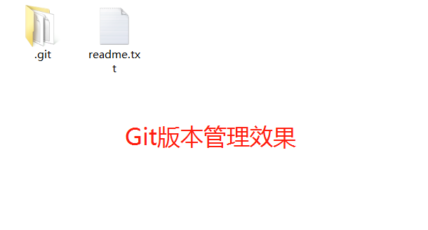
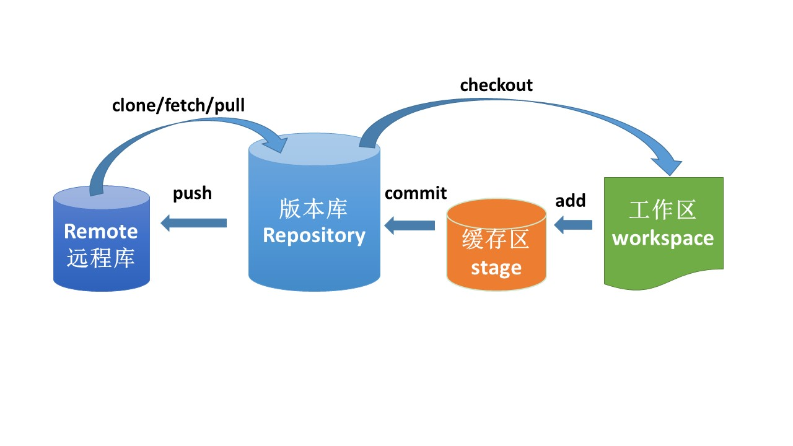
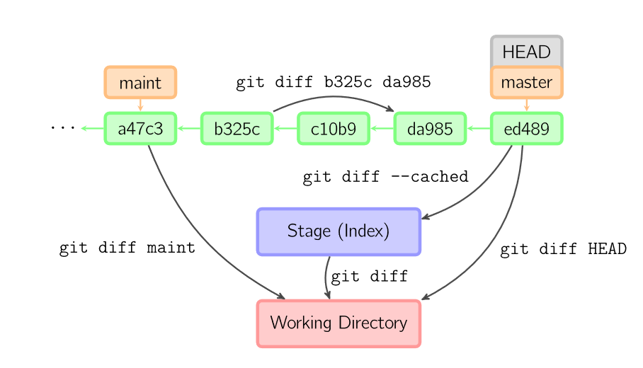
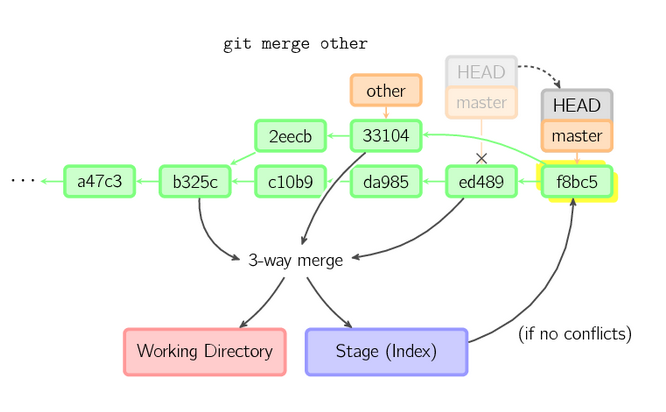

---
jupyter:
  jupytext:
    text_representation:
      extension: .md
      format_name: markdown
      format_version: '1.2'
      jupytext_version: 1.4.1
  kernelspec:
    display_name: Python 3
    language: python
    name: python3
---

# GitHub极简教程


GitHub是一个非常流行的全球代码托管平台，基于Git版本控制技术实现，同时GitHub也是一个活跃的开发者交流社区。许多的开源项目都在GitHub上发布。例如著名的Linux操作系统内核的源代码。


GitHub是什么？


```python


```

### 一，Git简介

Git是目前世界上最先进的分布式版本控制系统（没有之一）。

它由Linux系统之父Linus Torvalds在2005年用C语言开发。

Git是一个分布式版本控制系统，没有中央服务器，不同于svn等需要中央服务器的集中式版本控制系统。

Git的功能：版本控制（版本管理，远程仓库，分支协作）


**人工版本管理：**





**Git版本管理：**




```python


```

### 二，功能原理


* git版本控制系统由工作区，缓存区，版本库组成。
* git跟踪的是文件的修改而不是全部文件。
* git擅长管理代码等文本文件，不擅长管理图片等二进制文件。




```python


```

### 三，快速上手


1，安装配置Git.

下载位置: [Git下载链接](https://git-scm.com/downloads)—— https://git-scm.com/downloads

windows下载安装后可以在Gitbash中执行git命令，也可以在Jupyter Notebook中执行.

```python
!git config --global user.name "lyhue1991"
!git config --global user.email "lyhue1991@163.com"

# 出现一些类似 warning: LF will be replaced by CRLF in <file-name>. 可启用如下设置。
!git config --global core.autocrlf false

# 配置打印历史commit的快捷命令
!git config --global alias.lg "log --oneline --graph --all"
```

2，创建仓库

```python
!mkdir git-learn
!cd git-learn
```

```python
!git init
```

3，提交文件

```python
!echo "hello world" >>readme.txt
```

```python
!git add -A
```

```python
!git status
```

```python
!git commit -m"add readme.txt"
```

4，推送远程

```python
!git remote add origin https://github.com/lyhue1991/git-learn
```

```python
!git push -u origin master
```

5，克隆远程

```python
!git clone https://github.com/lyhue1991/Git-Tutorial-By-liaoxuefeng ../liaoxuefeng
```

```python

```

### 四，常用命令列表


**列了22个常用命令名**。

**举了44个示范命令**。


```python


```

### 五，版本回退


通过 git reset HEAD^ 可以回退到上一个版本。

通过git reset HEAD^^ 可以回退到上上个版本。

通过 git reset a234b3 可以回退到版本号为 a234b3的版本。

git 命令的选项如下：

git reset --hard  head^   修改版本库，保留暂存区，保留工作区

git reset --mixed head^  修改版本库，修改暂存区，保留工作区

git reset --soft  head^  修改版本库，保留暂存区，保留工作区

```python
!cd git-learn
```

```python
!gitk
```

```python
# %load readme.txt
"hello world" 

```

```python
!echo "hello China" >> readme.txt
```

```python
%pycat readme.txt  #查看readme.txt文件
```

```python
!git commit -a -m"C2"
```

```python
!echo "hello BeiJing" >>readme.txt
```

```python
!git add -A
```

```python
!git commit -m"C3"
```

```python
!gitk
```

```python
!git log --oneline --graph --all
```

```python
!git reset HEAD^
```

```python
!git reset --hard HEAD^
```

```python
%pycat readme.txt
```

```python
!git log --oneline --graph
```

```python

```

### 六，版本前进


如果 版本回退后想回到会退前的版本，可以用git reflog查看该版本的 commit id 进而根据版本号进行恢复。

```python
!git reflog
```

```python
!git reset --hard 1c73eda
```

```python
!git status
```

```python
%pycat readme.txt
```

```python


```

### 七，撤销修改


需要撤销工作区的修改，使用git checkout -- filename。如果文件之前已经添加到暂存区，则会用暂存区内容覆盖，如果暂存区已经被提交过了，则会用版本库中最新的版本覆盖。

git checkout -- file命令中的--很重要，没有--，就变成了“切换到另一个分支”的命令。

如果文件已经提交过了，但想用版本库中的最新版本文件覆盖工作区文件，可以用git reset HEAD

```python
!git status
```

```python
%pycat readme.txt
```

```python
%echo "hello Haidian">>readme.txt
```

```python
%pycat readme.txt
```

```python
!git add -A
```

```python
!git checkout -- readme.txt
```

```python
%pycat readme.txt
```

```python
!git checkout -- readme.txt
```

```python
%pycat readme.txt
```

### 八，删除文件


删除文件也是一种修改，git跟踪的是修改而非文件。因此删除文件可以直接在工作区手动删除文件，然后add -A 再 commit即可。对于已经提交过的文件，也可以用 git rm newfile.txt 直接删除工作区和暂存区文件，然后再 commit。

```python
!echo 'delete me'>> newfile.txt
```

```python
%pycat newfile.txt
```

```python
!git add -A
!git commit -m"add a newfile"
```

```python
!git rm newfile.txt
```

```python
!git commit -m"delete new file"
```

```python
!gitk
```

```python


```

### 九，比较文件


git diff 可以比较不同版本库的同名文件。




```python
%echo "hello HaiDian" >>readme.txt
```

```python
!git diff readme.txt
```

```python
!git add readme.txt
```

```python
!git diff --cached readme.txt
```

### 十，添加远程


通常可以用SSH协议和远程库通信或使用http协议和远程库通信。

http协议较为方便，但SSH协议方式速度较快。


ssh-keygen -t rsa -C "your_emial@xxx.com"


在 git bash中运行上述命令，并一路回车，在用户主目录里找到.ssh目录。

目录下的id_rsa有私钥，不能泄露出去。里面的id_rsa.pub是公钥，可分享给别人。

在GitHub——> settings ——> SSH Keys 页面添加SSH公钥。


ssh -T git@github.com


再在 git bash中运行上述命令，使得本机和github建立SSH连接

```python
# 可以使用SSH地址添加远程库
!git remote add github git@github.com:lyhue1991/git-learn
```

```python
# 也可以使用http地址添加远程库 #添加码云
!git remote add gitee https://gitee.com/Python_Ai_Road/git-learn  
```

```python
!git remote -v
```

```python
!git remote remove origin
```

```python
!git remote
```

```python


```

### 十一，推送远程


使用 git push 命令将当前仓库内容推送至远程仓库。

```python
!git remote -v
```

```python
!git push -u github master
# -u表示指定github为默认远程仓库，后面就可以不加任何参数使用git push了
```

```python
!echo "Hello TianAnMen!">>readme.txt
```

```python
%pycat readme.txt
```

```python
!git add -A
```

```python
!git commit -m"C6"
```

```python
!git push
```

```python
!gitk
```

### 十二，克隆远程


git clone可以将远程仓库克隆至本地某一目录，相当于下载。不指定仓库时，会克隆到当前目录下的一个文件夹。通常在github中把感兴趣的别人的项目fork到自己的仓库里，然后再使用clone方法下载到本地进行编辑。

```python
在github中左上角搜索 python教程，找到感兴趣的内容并fork之。
```

```python
!git clone  https://github.com/lyhue1991/python-basic ../python-basic
    
# 通常用 ./表示当前目录，../表示当前目录的父目录
```

```python
%cd ../python-basic
```

```python
!git status
```

```python
!gitk
```

### 十三，更新远程


fetch能够获取远程仓库的更新，但不同步到本地仓库。
fetch获取到的是修改，不会获取文件，而clone会获取文件。
可以在fetch之后利用merge，rebase等方法合并并同步到本地。


在github中的git-learn项目下新建一个 test.txt文件并commit。

```python
!git fetch github master
```

```python
!git status
```

```python
!git merge github/master
```

```python
!gitk
```

```python


```

### 十四，合并远程


git pull 能够或取远程仓库的更新，并同步合并到本地。

相当于git fetch之后再merge。有时候会有冲突，需要解决。

你可以在GitHub网站上的通过fork一些开源项目的代码，然后clone到本地后，尝试完善项目，再发送pull request到项目发起人，如果项目发起人通过了你的请求，那么你就为开源项目做出了贡献。


在github中的对应git-learn的readme.txt的最后一行加上"remote line"并commit.
在本地的git-learn的readme.txt的最后一行加上"local line"并commit.
则会发生冲突。

```python
!echo "local line" >>readme.txt
```

```python
%pycat readme.txt
```

```python
!git add -A
```

```python
!git commit -m"update local"
```

```python
!git pull github master
```

尝试git pull，但是出现了冲突，在本地文件打开readme.txt根据指引解决冲突。

解决冲突后add,commit,push即可。

```python
!git add -A
```

```python
!git commit -m"solve conflict"
```

```python
!git push
```

```python


```

### 十五，分支创建


通常在团队协作时经常需要使用分支功能。开发时大家在不同的分支上工作，互不冲突。

到一定开发阶段再使用分支合并功能综合大家的工作结果。

默认的分支为master,可以用git branch develop在当前位置创建分支。


git分支最佳实践：


* master: 主分支，主要用来版本发布。
* develop：日常开发分支，该分支正常保存了开发的最新代码。
* feature：具体的功能开发分支，只与 develop 分支交互。
* release：release 分支可以认为是 master 分支的未测试版。比如说某一期的功能全部开发完成，那么就将 develop 分支合并到 release 分支，测试没有问题并且到了发布日期就合并到 master 分支，进行发布。
* hotfix：线上 bug 修复分支。


```python
#创建和删除分支
```

```python
#在当前head位置创建分支 develop
!git branch develop 
```

```python
!git log --oneline --graph
```

```python
# 在某个commit id 号位置创建分支 feature
!git branch feature 1c73eda
```

```python
!gitk
```

```python
!git branch
```

```python
# 查看包括远程同步仓库的所有分支
!git branch -a
```

```python
# 删除分支 feature
!git branch -d feature
```

```python
!git branch
```

### 十六，分支切换


使用 git checkout develop 可以从当前分支切换到 develop分支。

使用 git checkout -b feature 可以在当前HEAD位置创建新分支 feature 并将HEAD切换到新分支。

```python
!git checkout develop
```

```python
!gitk
```

```python
!git checkout -b feature
```

```python
!gitk
```

```python


```

### 十七，分支合并


merge方法可以将两个有共同祖先节点的不同分支进行合并。

如果其中一个分支完全领先于另外一个分支，那么默认会采用fast forward合并方式。

如果两个分支在分叉后各自都有新的commit，那么会是一种三方合并方式。

第二种情况下可能需要解决冲突。


fast forward合并方式:


三方合并方式：




```python
使用 no-ff模式可以保留被合并分支的原有信息。
```


```python
!git checkout master
```

```python
!echo "writen by master branch" >>readme.txt
```

```python
!git add -A
```

```python
!git commit -m"master branch"
```

```python
!gitk
```

```python
!git checkout develop
```

```python
!echo "writen by develop branch" >>readme.txt
```

```python
!git commit -am"develop branch"
```

```python
!git log --oneline --graph --all
```

```python
!git checkout master
```

```python
!git merge develop
```

```python
"hello world" 
"hello China" 
"hello BeiJing" 
"hello HaiDian" 
"Hello TianAnMen!"
"local line" 
<<<<<<< HEAD
"writen by master branch" 
=======
"writen by develop branch" 
>>>>>>> develop
```

```python
解决冲突后重新提交
```

```python
!git add -A
```

```python
!git commit -m"merged"
```

```python
!gitk
```

### 十八，分支重演


除了使用merge方法整合不同分支的内容外，分支重演rebase也是一种整合不同分支内容的方法。
但相对复杂一些。


```python
!git log --oneline --graph --all
```

```python
!git reset --hard b16a1bd
```

```python
!git rebase develop
```

```python
!git add readme.txt
```

```python
!git rebase --continue
```

```python
!git commit -m"rebase over"
```

```python
!git checkout master
```

```python
!git log --oneline --graph --all
```

```python
!gitk
```

```python


```

### 十九，储藏管理


如果工作只进行到一半，还没法提交。

但出现了一个着急的事情需要马上切换去解决，例如修复一个临时bug。

有没有什么办法呢?

Git提供的stash功能非常适用于这种需要现场保存的情境。

把当前工作现场“储藏”起来，等以后恢复现场后继续工作。

```python
!echo 'not done!' >>readme.txt
```

```python
git stash;
git stash pop;
git stash list;
git stash save "message"
git stash apply @{X}
```

```python
!git stash list
```

```python
!git stash
```

```python
!git stash list
```

```python
!git stash pop
```

```python
!echo "done 50%..." >>readme.txt
```

```python
!git stash save "50%done"
```

```python
!git stash list
```

```python
!echo "done 75%..." >>readme.txt
```

```python
!git stash
```

```python
!git stash list
```

```python
!git stash apply 0
```

```python
!git stash list
```

```python
!git stash drop 0
```

```python
%cd ./git-learn
```

```python
!gitk --all
```

### 二十，标签管理


用标签记录版本号会更加方便协作管理。

如果团队间按如下方式沟通将很麻烦：

“请把上周一的那个版本打包发布，commit号是6a5819e...”

而有了版本号将会方便许多：

“请把上周一的那个版本打包发布，版本号是v1.2”

标签和分支很像，都是指向commit id的指针，但标签不能移动而分支能够移动。

```python
# 当前head位置打上v2.0标签
!git tag v2.0
```

```python
# 在commit id 为 4e30082位置打上 v1.0标签
!git tag v1.0 4e30082
```

```python
# 查看全部标签
!git tag
```

```python
# 查看标签对应的版本号等信息
!git show v1.0
```

```python
# 推送标签到远程
!git push github v1.0
```

```python
# 删除标签
!git tag -d v1.0
```

```python
# 删除远程标签
!git push github :refs/tags/v1.0
```

```python
!git log --oneline
```
