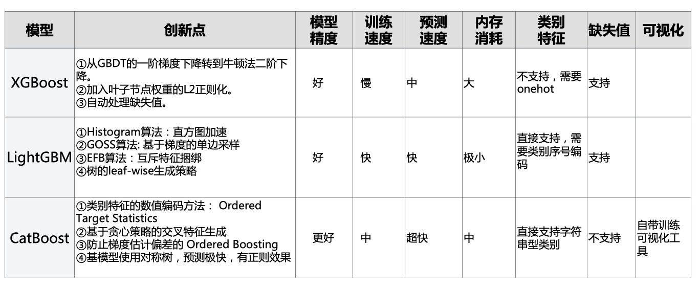
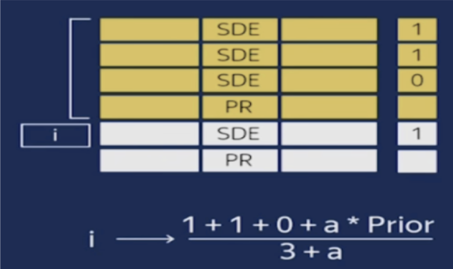
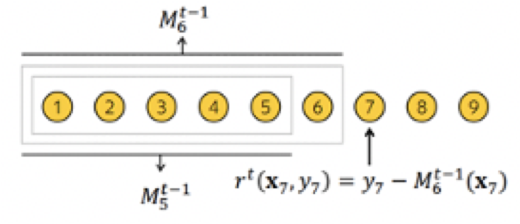
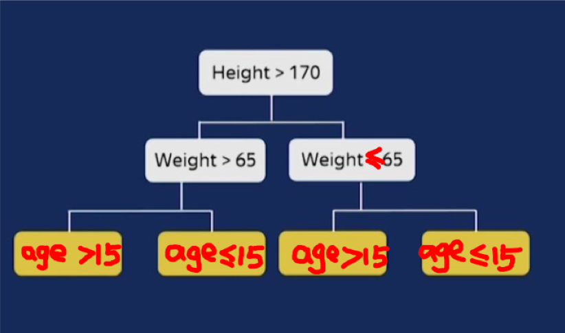

---
jupyter:
  jupytext:
    text_representation:
      extension: .md
      format_name: markdown
      format_version: '1.3'
      jupytext_version: 1.11.2
  kernelspec:
    display_name: Python 3
    language: python
    name: python3
---

# 30分钟学会CatBoost 


### 一，CatBoost简介


CatBoost和XGBoost、LightGBM并称为GBDT的三大主流神器，都是在GBDT算法框架下的一种改进实现。

正如其名字所说那样，CatBoost主要是在类别特征上的处理上做了很多的改进。

从用户使用角度来看，相比XGBoost和LightGBM，CatBoost具有如下特点。

* 模型精度：XGBoost和LightGBM相当，CatBoost往往略好一些，无需调参即可获取很好的结果。

* 训练速度：LightGBM远快于XGBoost，CatBoost快于XGBoost但比LightGBM慢。

* 预测速度：LightGBM与XGBoost相当，CatBoost远快于LightGBM与XGBoost，是它们的几十分之一。

* 内存消耗：LightGBM远小于XGBoost，CatBoost小于XGBoost，但大于LightGBM。

* 类别特征：XGBoost不支持类别特征，需要OneHot编码预处理。LightGBM支持类别特征，需转换成整数编码。CatBoost提供更强大的对类别特征的支持，直接支持字符串类型的类别特征，无需预处理。

* 缺失值特征：XGBoost和LightGBM都可以自动处理特征缺失值，CatBoost不能自动处理缺失值(或者将缺失值视为最小值/最大值)。

* GPU支持：LightGBM与CatBoost支持GPU训练，XGBoost不支持GPU训练。

* 可视化：CatBoost还自带一套可视化工具，可以在Jupyter Notebook或者TensorBoard中实时看到指标变化。

CatBoost主要创新点如下：

* 类别特征的 Ordered Target Statistics 数值编码方法。

* 基于贪心策略的特征组合方法。

* 避免预测偏移的 Ordered Boosting 方法。

* 使用对称二叉树作为基模型，有正则作用且预测极快。




```python

```

### 二，原理说明


#### 1, 类别特征的Ordered Target Statistics 数值编码方法 

<!-- #region -->
对于类别特征，如果类别数目不多，可以使用onehot编码。

但如果类别数量成百上千，使用onehot编码会导致特征数量爆炸。

CatBoost设计了一种基于预测目标统计值的方法可以将类别特征转化为数值特征。


以风控领域的预测信贷用户是否会违约为例，假设有一个类别特征是根据身份证号码解析出来的用户所出生的城市。

全国有几百个城市，转化为onehot编码会造成特征维数爆炸。

一种非常make sense 的方式是我们用某个城市用户的平均逾期率来作为该城市的数值特征编码。

简而言之,我们用如下方式将 city = "上海" 这一类别特征取值 代替为如下值。

city_numeric("上海") = sample_count(city="上海" and label=1(逾期)) / sample_count(city="上海")

这就是所谓的 Target Statistics 编码方法。

但是考虑到有一些小城市，比如黑龙江鹤岗市，可能在训练样本中数量很少甚至没有，这时候用训练样本中鹤岗市的用户平均逾期率来估计会比较不靠谱。

例如鹤岗市只有1个样本，并且这个样本是逾期的，那么数值编码

city_numeric("鹤岗") = sample_count(city="鹤岗" and label=1(逾期)) / sample_count(city="鹤岗") = 1.0

我们可以考虑加入先验值来抑制这种小样本的波动。

假设不区分城市，全部训练样本中用户的 逾期率 为 P = 0.1, 我们可以在分子分母上分别加入 a = 100个 逾期率为P 的先验样本。


city_numeric("鹤岗") = (sample_count(city="鹤岗" and label=1(逾期)) + a·P) / （sample_count(city="鹤岗")+ a） = 11/101

这样就合理多了。


这种数值编码方式虽然好，但是会造成训练集中 label的泄露，因为对于某个样本来说，其数值编码计算过程中已经把这个样本的 label值纳入了计算过程中。

未来要预测的验证集的数据分布未必与训练集相同，例如训练集中 上海市 用户的平均逾期率为 0.12，但是验证集中上海市用户的平均逾期率可能只有0.04，在训练集中这个 city_numeric特征可能会特别好用，特别重要，但是在验证集中可能会变得没有那么好用，没有那么重要。

为了让模型正确地评估 city_numeric 特征的真实有效性和重要程度，我们可以拿出一部分数据来计算这个 特征编码，用另外一部分数据来训练。但是这样会造成可用数据的减少。

CatBoost巧妙地设计了如下trick，来缓解这个问题。先将样本随机打乱，然后每个样本只使用它排序在它前面的样本来计算其类别特征的数值编码。这样就防止了label的泄露，并且能够较为合理地评估 这个特征的真实有效性。

不过这种方式会造成排在前面的样本的类别特征的数值编码估计不是很准，为了减少这个影响，CatBoost会设计多个样本随机排列(默认4个)，在每次建树前从中随机取一个排列。

以上就是所谓的 Ordered Target Statistics 编码方法，也是CatBoost最重要的创新。



<!-- #endregion -->

```python

```

#### 2，基于贪心策略的特征交叉方法


使用Ordered Target Statistics 方法将类别特征转化成为数值特征以后，会影响到特征交叉，因为数值特征无法有效地进行交叉。

依然以风控领域的预测信贷用户是否会违约为例，假设 city="北京市" 且 job="保安" 的用户信用特别好，但不是北京市所有的用户都信用好，也不是所有的保安都信用特别好。 只有北京市的保安这个群体才信用好。

如果我们将 city转换为数值编码，也将保安转换为数值编码之后，我们得到两个数，这两个数相乘是没有意义的，我们无法表示 北京市的保安这个群体。

为了有效地利用特征交叉，CatBoost 在将类别特征转换为数值编码的同时，会自动生成 交叉特征。

如果让全部的类别特征之间都进行交叉，两两交叉，三三交叉，四四交叉，这个复杂度是指数级的，特征维度一定会爆炸。

CatBoost使用一种贪心的策略来进行特征交叉。生成tree的第一次分裂，CatBoost不使用任何交叉特征。在后面的分裂中，CatBoost会使用生成tree所用到的全部原始特征和交叉特征 跟 数据集中的全部 类别特征进行交叉。

在定义CatBoost模型时，我们可以用'max_ctr_complexity' 来控制允许的特征交叉的最大特征数量，如果设置为3，那么生成tree时所用到的交叉特征最多只会来自3个特征的交叉，也就是我们只能表示 city='北京市' 且 job='保安' 且 education='高中'这样的三阶交叉特征，而无法表示  city='北京市' 且 job='保安' 且 education='高中' 且 hobby='抽烟' 这样的四阶交叉特征。


```python

```

#### 3，避免预测偏移的 Ordered Boosting 方法。

<!-- #region -->
使用XGBoost或者LightGBM做模型时，我们可能经常会发现模型在训练集上拟合的很好，train_auc甚至达到了1.0, 但是在验证集上却差了很多, va_auc 可能只有0.7。这当然有可能是因为tree的数量太多了，或者是每棵tree的leaves太多了，总之模型太复杂了造成了过拟合。

但也有一些XGBoost和LightGBM自身算法的缺陷因素。我们知道LightGBM在训练下一棵tree的时候，需要计算前面这些tree构成的加法模型在所有样本上的一阶梯度和二阶梯度(Loss对模型预测结果的导数)，然后用这些梯度来决定下一棵树的结构和叶子节点取值。

但是我们计算的这些一阶梯度和二阶梯度值是问题的。前面的这些tree都是在这些样本上训练的，现在我们又在这些样本上估计模型预测结果的一阶和二阶梯度。我们应该换一些新的样本才更合理。但是我们从哪里找这些新的样本呢？

CatBoost 的作者故伎重演。先将样本随机打乱，然后每个样本只使用排序在它前面的样本来训练模型。用这样的模型来估计这个样本预测结果的一阶和二阶梯度。然后用这些梯度构建一棵tree的结构，最终tree的每个叶子节点的取值，是使用全体样本进行计算的。

这就是Ordered Boosting的主要思想。可以有效地减少梯度估计的误差，缓解预测偏移。但是会增加较多的计算量，影响训练速度。


在定义CatBoost模型时，我们可以用'boosting_type'这个参数来设置是使用Ordered Boosting 还是 LightGBM那样的 Plain Boosting。如果不显式设置，CatBoost会根据样本和特征数量自己决定。



<!-- #endregion -->

```python

```

#### 4，使用对称二叉树作为基模型，有正则作用且预测极快


XGBoost和LightGBM采用的基模型是普通的二叉树，但是CatBoost采用的是对称的二叉树。

这种对树结构上的约束有一定的正则作用。更为重要的是，它可以让CatBoost模型的推断过程极快。

对于CatBoost的tree的预测过程来说，每个特征的分裂都是独立的，不分先后顺序，多个样本可以一起预测。




```python

```

### 三，使用范例

```python
#!pip install catboost 
import catboost as cb 
print(cb.__version__)
```

```python
from IPython.display import display 

import datetime,json
import numpy as np
import pandas as pd
import catboost as cb 
from catboost.datasets import titanic
from sklearn import datasets
from sklearn.model_selection import train_test_split
from sklearn.model_selection import StratifiedKFold

from sklearn.metrics import f1_score,roc_auc_score,accuracy_score
import plotly.graph_objs as go 
import plotly.express as px 


def printlog(info):
    nowtime = datetime.datetime.now().strftime('%Y-%m-%d %H:%M:%S')
    print("\n"+"=========="*8 + "%s"%nowtime)
    print(info+'...\n\n')
     
#================================================================================
# 一，准备数据
#================================================================================
printlog("step1: preparing data...")

dfdata,dftest = titanic()

display(dfdata.head()) 

label_col = "Survived"

# 填充空值特征
dfnull = pd.DataFrame(dfdata.isnull().sum(axis=0),columns = ["null_cnt"]).query("null_cnt>0")
print("null_features:") 
print(dfnull)

dfdata.fillna(-9999, inplace=True)
dftest.fillna(-9999, inplace=True)


# 刷选类别特征
cate_cols = [x for x in dfdata.columns 
             if dfdata[x].dtype not in [np.float32,np.float64] and x!=label_col]
for col in cate_cols:
    dfdata[col] = pd.Categorical(dfdata[col]) 
    dftest[col] = pd.Categorical(dftest[col]) 

# 分割数据集
dftrain,dfvalid = train_test_split(dfdata, train_size=0.75, random_state=42)
Xtrain,Ytrain = dftrain.drop(label_col,axis = 1),dftrain[label_col]
Xvalid,Yvalid = dfvalid.drop(label_col,axis = 1),dfvalid[label_col]
cate_cols_indexs = np.where(Xtrain.columns.isin(cate_cols))[0]


# 整理成Pool
pool_train = cb.Pool(data = Xtrain, label = Ytrain, cat_features=cate_cols)
pool_valid = cb.Pool(data = Xvalid, label = Yvalid, cat_features=cate_cols)


#================================================================================
# 二，设置参数
#================================================================================
printlog("step2: setting parameters...")
                               
iterations = 1000
early_stopping_rounds = 200

params = {
    'learning_rate': 0.05,
    'loss_function': "Logloss",
    'eval_metric': "Accuracy",
    'depth': 6,
    'min_data_in_leaf': 20,
    'random_seed': 42,
    'logging_level': 'Silent',
    'use_best_model': True,
    'one_hot_max_size': 5,   #类别数量多于此数将使用ordered target statistics编码方法,默认值为2。
    'boosting_type':"Ordered", #Ordered 或者Plain,数据量较少时建议使用Ordered,训练更慢但能够缓解梯度估计偏差。
    'max_ctr_complexity': 2, #特征组合的最大特征数量，设置为1取消特征组合，设置为2只做两个特征的组合,默认为4。
    'nan_mode': 'Min' 
}


#================================================================================
# 三，训练模型
#================================================================================
printlog("step3: training model...")


model = cb.CatBoostClassifier(
    iterations = iterations,
    early_stopping_rounds = early_stopping_rounds,
    train_dir='catboost_info/',
    **params
)


#直接训练
model.fit(
    pool_train,
    eval_set=pool_valid,
    plot=True
)

print("model.get_all_params():")
print(model.get_all_params() )


#5折交叉验证
cv_data= cb.cv(
    cb.Pool(dfdata.drop(label_col,axis = 1), dfdata[label_col], cat_features=cate_cols_indexs),
    params,
    fold_count = 3,
    plot=True
)

print('Best validation accuracy score: {:.2f}±{:.2f} on step {}'.format(
    np.max(cv_data['test-Accuracy-mean']),
    cv_data['test-Accuracy-std'][np.argmax(cv_data['test-Accuracy-mean'])],
    np.argmax(cv_data['test-Accuracy-mean'])
))


#================================================================================
# 四，评估模型
#================================================================================
printlog("step4: evaluating model ...")


y_pred_train = model.predict(Xtrain)
y_pred_valid = model.predict(Xvalid)

train_score = f1_score(Ytrain,y_pred_train)
valid_score = f1_score(Yvalid,y_pred_valid)


print('train f1_score: {:.5} '.format(train_score))
print('valid f1_score: {:.5} \n'.format(valid_score))   


#feature importance 
dfimportance = model.get_feature_importance(prettified=True) 
dfimportance = dfimportance.sort_values(by = "Importances").iloc[-20:]
fig_importance = px.bar(dfimportance,x="Importances",y="Feature Id",title="Feature Importance")

display(dfimportance)
display(fig_importance)


#score distribution
y_test_prob = model.predict_proba(dftest)[:,-1]
trace1 = go.Histogram(x = y_test_prob,histnorm = 'probability',nbinsx=50)
layout = go.Layout(title = "Score Distribution",xaxis={"title":"score"},yaxis = {"title":"frequecy"})
fig_distribution = go.Figure(data = [trace1])
fig_distribution.update_layout(layout)
display(fig_distribution)


#================================================================================
# 五，使用模型
#================================================================================
printlog("step5: using model ...")

y_pred_test = model.predict(dftest)
y_pred_test_prob = model.predict_proba(dftest)

print("y_pred_test:\n",y_pred_test[:10])
print("y_pred_test_prob:\n",y_pred_test_prob[:10])


#================================================================================
# 六，保存模型
#================================================================================
printlog("step6: saving model ...")

model_dir = 'catboost_model'
model.save_model(model_dir)
model_loaded = cb.CatBoostClassifier()
model.load_model(model_dir)

```

```python

```

```python

```
