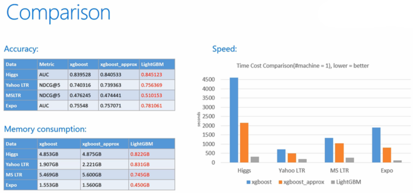
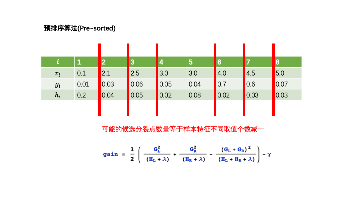
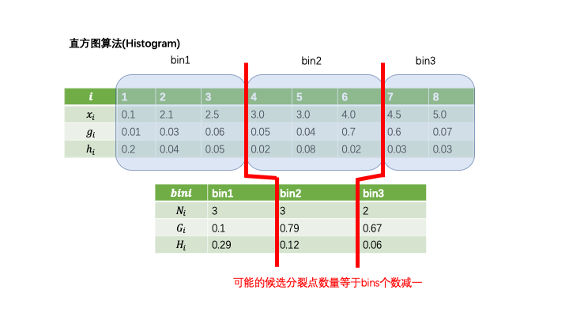
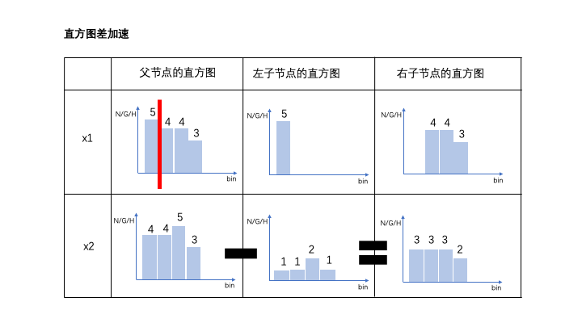
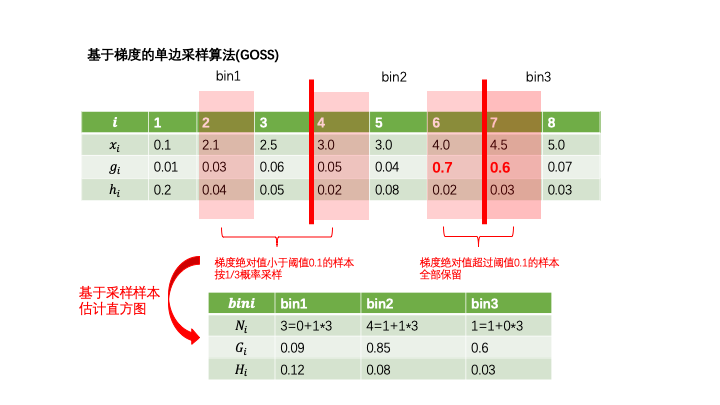
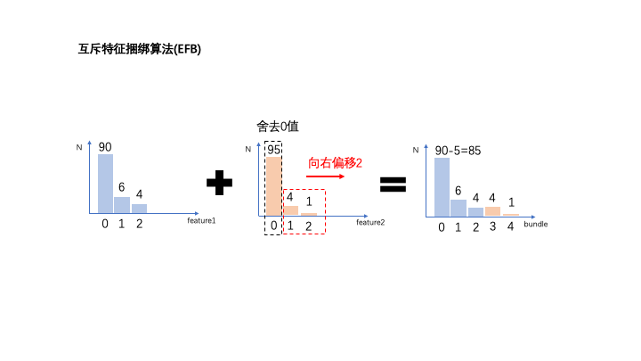

# 30分钟看懂LightGBM基本原理


### 一，LightGBM和XGBoost对比


LightGBM可以看成是XGBoost的升级加强版本，2017年经微软推出后，便成为各种数据竞赛中刷分拿奖的神兵利器。

正如其名字中的Light所蕴含的那样，和XGBoost相比，LightGBM在大规模数据集上跑起来更加轻盈。

* 模型精度：XGBoost和LightGBM相当。

* 训练速度：LightGBM远快于XGBoost。

* 内存消耗：LightGBM远小于XGBoost。

* 缺失值特征：XGBoost和LightGBM都可以自动处理特征缺失值。

* 分类特征：XGBoost不支持类别特征，需要OneHot编码预处理。LightGBM直接支持类别特征。





### 二，LightGBM的性能优化原理


LightGBM在XGBoost上主要有3方面的优化。

1，Histogram算法:直方图加速算法。

2，GOSS算法:基于梯度的单边采样算法。

3，EFB算法:互斥特征捆绑算法。

可以用如下一个简单公式来说明LightGBM和XGBoost的关系：

LightGBM = XGBoost + Histogram + GOSS + EFB。


那么，Histogram算法，GOSS算法，和EFB算法分别从什么角度对XGBoost进行性能优化呢？

我们先概括性地从全局进行分析，然后再逐个加以介绍。

XGBoost模型训练的总体的复杂度可以粗略估计为：

训练复杂度 = 树的棵数✖️每棵树上叶子的数量✖️生成每片叶子的复杂度

由于XGBoost采用的基模型是二叉树，因此生成每片叶子需要分裂一次。

而每次分裂，需要遍历所有特征上所有候选分裂点位，计算按照这些候选分裂点位分裂后的全部样本的目标函数增益，找到最大的那个增益对应的特征和候选分裂点位，从而生成一片新叶子。因此生成一片叶子的复杂度可以粗略估计为：

生成一片叶子的复杂度 = 特征数量✖️候选分裂点位数量✖️样本的数量。

而Hitogram算法的作用是减少候选分裂点位数量，GOSS算法的作用是减少样本的数量，EFB算法的作用是减少特征的数量。

通过这3个算法的引入，LightGBM生成一片叶子需要的复杂度大大降低了，从而极大节约了计算时间。

同时Histogram算法还将特征由浮点数转换成0~255位的整数进行存储，从而极大节约了内存存储。


1，Histogram算法


直方图算法是替代XGBoost的预排序(pre-sorted)算法的。

预排序算法首先将样本按照特征取值排序，然后从全部特征取值中找到最优的分裂点位，该算法的候选分裂点数量与样本数量成正比。

而直方图算法通过将连续特征值离散化到固定数量(如255个)的bins上，使得候选分为点位为常数个(num_bins -1).

此外，直方图算法还能够作直方图差加速。当节点分裂成两个时，右边叶子节点的直方图等于其父节点的直方图减去左边叶子节点的直方图。

从而大大减少构建直方图的计算量。











2，GOSS算法


GOSS算法全称为Gradient-based One-Side Sampling，即基于梯度的单边采样算法。

其主要思想是通过对样本采样的方法来减少计算目标函数增益时候的复杂度。

但如果对全部样本进行随机采样，势必会对目标函数增益的计算精度造成较大的影响。

GOSS算法的创新之处在于它只对梯度绝对值较小的样本按照一定比例进行采样，而保留了梯度绝对值较大的样本。

这就是所谓的单边采样。由于目标函数增益主要来自于梯度绝对值较大的样本，因此这种方法在计算性能和计算精度之间取得了很好的平衡。





3，EFB算法


EFB算法全称是Exclusive Feature Bundling，即互斥特征绑定算法。

EFB算法可以有效减少用于构建直方图的特征数量，从而降低计算复杂度，尤其是特征中包含大量稀疏特征的时候。

在许多应用场景下，数据集中会有大量的稀疏特征，这些稀疏特征大部分样本都取值为0，只有少数样本取值非0。

通常可以认为这些稀疏特征是互斥的，即它们几乎不会同时取非零值。

利用这种特性，可以通过对某些特征的取值重新编码，将多个这样互斥的特征捆绑成为一个新的特征。

有趣的是，对于类别特征，如果转换成onehot编码，则这些onehot编码后的多个特征相互之间是互斥的，

从而可以被捆绑成为一个特征。因此，对于指定为类别特征的特征，LightGBM可以直接将每个类别取值和一个bin关联，从而自动地处理它们。

而无需预处理成onehot编码多此一举。





### 三，LightGBM的使用范例

```python
%matplotlib auto
```

```python
import datetime
import numpy as np
import pandas as pd
import lightgbm as lgb
from sklearn import datasets
from sklearn.model_selection import train_test_split
from sklearn.metrics import accuracy_score


def printlog(info):
    nowtime = datetime.datetime.now().strftime('%Y-%m-%d %H:%M:%S')
    print("\n"+"=========="*8 + "%s"%nowtime)
    print(info+'...\n\n')

#================================================================================
# 一，读取数据
#================================================================================
printlog("step1: reading data...")

# 读取dftrain,dftest
breast = datasets.load_breast_cancer()
df = pd.DataFrame(breast.data,columns = [x.replace(' ','_') for x in breast.feature_names])
df['label'] = breast.target
df['mean_radius'] = df['mean_radius'].apply(lambda x:int(x))
df['mean_texture'] = df['mean_texture'].apply(lambda x:int(x))
dftrain,dftest = train_test_split(df)

categorical_features = ['mean_radius','mean_texture']
lgb_train = lgb.Dataset(dftrain.drop(['label'],axis = 1),label=dftrain['label'],
                        categorical_feature = categorical_features)

lgb_valid = lgb.Dataset(dftest.drop(['label'],axis = 1),label=dftest['label'],
                        categorical_feature = categorical_features,
                        reference=lgb_train)

#================================================================================
# 二，设置参数
#================================================================================
printlog("step2: setting parameters...")
                               
boost_round = 50                   
early_stop_rounds = 10

params = {
    'boosting_type': 'gbdt',
    'objective':'binary',
    'metric': ['auc'],
    'num_leaves': 31,   
    'learning_rate': 0.05,
    'feature_fraction': 0.9,
    'bagging_fraction': 0.8,
    'bagging_freq': 5,
    'verbose': 0
}

#================================================================================
# 三，训练模型
#================================================================================
printlog("step3: training model...")


results = {}
gbm = lgb.train(params,
                lgb_train,
                num_boost_round= boost_round,
                valid_sets=(lgb_valid, lgb_train),
                valid_names=('validate','train'),
                early_stopping_rounds = early_stop_rounds,
                evals_result= results)

#================================================================================
# 四，评估模型
#================================================================================
printlog("step4: evaluating model ...")

y_pred_train = gbm.predict(dftrain.drop('label',axis = 1), num_iteration=gbm.best_iteration)
y_pred_test = gbm.predict(dftest.drop('label',axis = 1), num_iteration=gbm.best_iteration)

print('train accuracy: {:.5} '.format(accuracy_score(dftrain['label'],y_pred_train>0.5)))
print('valid accuracy: {:.5} \n'.format(accuracy_score(dftest['label'],y_pred_test>0.5)))

lgb.plot_metric(results)
lgb.plot_importance(gbm,importance_type = "gain")

#================================================================================
# 五，保存模型
#================================================================================
printlog("step5: saving model ...")


model_dir = "data/gbm.model"
print("model_dir: %s"%model_dir)
gbm.save_model("data/gbm.model")
printlog("task end...")

###
##
#
```

```python
%matplotlib auto
lgb.plot_metric(results,metric = "auc")
```

```python
%matplotlib auto
lgb.plot_importance(gbm,importance_type = "gain")
```
