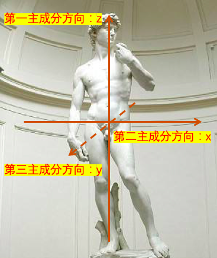
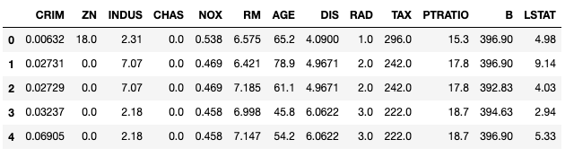
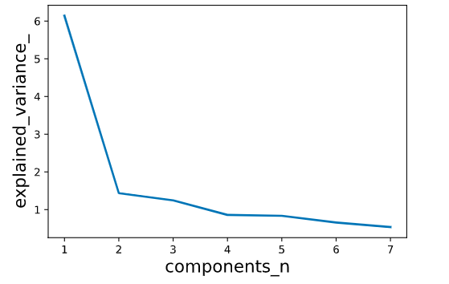

---
jupyter:
  jupytext:
    text_representation:
      extension: .md
      format_name: markdown
      format_version: '1.2'
      jupytext_version: 1.4.1
  kernelspec:
    display_name: Python 3
    language: python
    name: python3
---

# 30分钟学会PCA主成分分析


PCA主成分分析算法(Principal Components Analysis)是一种最常用的降维算法。能够以较低的信息损失(以样本间分布方差衡量)减少特征数量。

PCA算法可以帮助分析样本中分布差异最大的成分(主成分)，有助于数据可视化(降低到2维或3维后可以用散点图可视化)，有时候还可以起到降低样本中的噪声的作用(丢失的信息有部分是噪声)。


### 一，PCA算法的直觉理解


从直觉上看，PCA主成分分析类似于依次寻找一群样本点的各个位置差异最大的方向长轴。



假定把一个人身上的所有细胞看成一个一个的样本点。这些样本点可以用3个坐标来表示，从左到右为x方向，从前到后为y方向，从下到上为z方向。

那么它们的第一个主成分是什么呢？第一个主成分对应的长轴是沿着人的脚到头的方向，也就是通常的上下方向，即z方向。这个方向是最主要的长轴。这些样本点的位置差异基本上70%以上来自于这个方向上的差异。

它们的第二个主成分是什么呢？第二个主成分对应的方向是沿着人的左臂到右臂的方向，也就通常的左右方向，即y方向。这个方向和第一个主成分长轴垂直，这些样本点的位置差异大概有20%左右来自这个方向上的差异。

它们的第三个主成分是什么呢？第三个主成分方向是沿着人的前胸到后背的方向，也就是通常的前后方向，即x方向。这个方向和前两个主成分长轴垂直，样本点的位置差异有一般只有不到10%来自这个方向的差异，当然，有些身材比较圆润的同学除外。

现在，如果要将这些样本点的坐标减少到用2个来表示，并尽可能多的保留样本点之间位置差异的信息，那么，显然，应该保留第一个主成分坐标和第二个主成分坐标。

现在，假定这个人躺在一个斜的躺椅上，那么现在这些样本点的第一主成分显然不再是从下到上的z方向。我们应该将我们的坐标系作一个旋转，让z轴和斜着的躺椅方向一致，这个新的z方向是这些样本点的第一主成分方向。类似地，也需要旋转x轴和y轴得到新的第二主成分方向和第三主成分方向。

这个旋转旧坐标系以找到主成分方向的过程就是PCA主成分分析。


```python

```

### 二，PCA算法的数学说明


PCA主成分分析(Principal Components Analysis)是一种通过**正交线性组合**方式，**最大化保留样本间方差**的**降维**方法。

用几何观点来看，PCA主成分分析方法可以看成通过正交变换，对坐标系进行旋转和平移，并保留样本点投影坐标方差最大的前几个新的坐标。

这里有几个关键词需要说明:

* 降维：将样本原来的m维特征用更少的k个特征取代。降维算法可以理解成一种数据压缩方法，它可能会丢失一些信息。

* 正交线性组合：k个新特征是通过对m个旧特征进行线性组合产生的，并且k个线性组合的系数向量为单位向量，且彼此相互正交。

* 最大化保留样本间方差：第1个主成分特征最大化样本间特征方差，第2个主成分特征在满足与第1个主成分正交约束条件下最大化样本间特征方差，……。


```python

```

### 三，PCA算法的调包范例


下面的范例我们调用sklearn中的PCA降维算法接口，对波士顿房价数据集进行降维(13维降到7维)。


```python
import numpy as np
import pandas as pd

import matplotlib.pyplot as plt
from sklearn import datasets

boston = datasets.load_boston()
dfdata = pd.DataFrame(boston.data,columns = boston.feature_names)
dfdata.head()
```



```python

```

```python
# 不同特征取值范围相差较大，我们首先进行标准正态归一化
# 归一化的结果作为 PCA降维的输入
from sklearn.preprocessing import StandardScaler
scaler = StandardScaler()
scaler.fit(dfdata.values)
X_input = scaler.transform(dfdata.values)

# 我们的输入有506个样本，13维特征
print(X_input.shape)

```

```
(506, 13)
```

```python
# 应用PCA进行降维

from sklearn.decomposition import PCA
pca = PCA(n_components=7)
pca.fit(X_input)
X_output = pca.transform(X_input)

# 降维后，只有7维特征
print(X_output.shape)

```

```
(506, 7)
```

```python

```

```python
# 查看各个主成分对应的方差大小和占全部方差的比例
# 可以看到前7个主成分已经解释了样本分布的90%的差异了。

print("explained_variance:")
print(pca.explained_variance_)

print("explained_variance_ratio:")
print(pca.explained_variance_ratio_)

print("total explained variance ratio of first 7 principal components:")
print(sum(pca.explained_variance_ratio_))

```

```
explained_variance:
[6.1389812  1.43611329 1.2450773  0.85927328 0.83646904 0.65870897
 0.5364162 ]
explained_variance_ratio:
[0.47129606 0.11025193 0.0955859  0.06596732 0.06421661 0.05056978
 0.04118124]
total explained variance ratio of first 7 principal components:
0.8990688406240493
```

```python
#可视化各个主成分贡献的方差
%matplotlib inline
%config InlineBackend.figure_format = 'svg'

import matplotlib.pyplot as plt
plt.figure()
plt.plot(np.arange(1,8),pca.explained_variance_,linewidth=2)
plt.xlabel('components_n', fontsize=16)
plt.ylabel('explained_variance_', fontsize=16)
plt.show()
```



```python
# 查看降维对应的正交变换矩阵，即各个投影向量
W = pca.components_
# 验证正交关系
np.round(np.dot(W,np.transpose(W)),6)

```

```
array([[ 1.,  0., -0., -0., -0.,  0., -0.],
       [ 0.,  1., -0.,  0.,  0., -0., -0.],
       [-0., -0.,  1.,  0., -0.,  0., -0.],
       [-0.,  0.,  0.,  1., -0., -0.,  0.],
       [-0.,  0., -0., -0.,  1.,  0.,  0.],
       [ 0., -0.,  0., -0.,  0.,  1., -0.],
       [-0., -0., -0.,  0.,  0., -0.,  1.]])
```

```python
# 对降维后的数据的前两维进行散点图可视化

%matplotlib inline
%config InlineBackend.figure_format = 'svg'

plt.scatter(X_output[:,0],X_output[:,1])
plt.xlabel("components_1")
plt.ylabel("components_2")
plt.show()

```


```python

```

### 四 ，PCA算法的数学原理


前方高数提醒。

下面进行PCA算法的数学原理推演，证明第k个主成分投影向量恰好是样本的协方差矩阵的第k大特征值对应的特征向量。

下面的推演会会用到高等数学中的一些线性代数知识和微积分知识。

没有相关数学基础的同学可以跳过，在实践中只要掌握PCA算法的直觉概念和调包使用方法，基本就够用了。


假定样本特征用矩阵$X$表示， 其每一行表示一个样本，每一列表示一个特征。

假定$X$是 $n\times m$维的，即$n$个样本，$m$维特征。

现在寻找$X$的第一个主成分。

假定第一个主成分投影向量是$w$，它是一个单位列向量，维数为$m$， 

则$X$投影后的坐标是

$$y  = Xw$$

投影后的样本间的坐标方差可以表示为

$$var(y) = (Xw - \overline{Xw})^T(Xw - \overline{Xw})$$

杠杠表示对样本求平均，由于$w$与样本无关，可以化简为:

$$var(y) = ((X - \overline{X})w)^T(X - \overline{X})w$$
$$var(y) = w^T(X - \overline{X})^T(X - \overline{X})w$$

注意到 $(X - \overline{X})^T(X - \overline{X})$恰好为 $X$的协方差矩阵。


下面我们要让这个坐标方差最大化，同时$w$要满足单位长度约束:

$$w^Tw = 1$$

对于含有约束条件的极值条件求解，我们可以应用微积分中的拉格朗日乘子法。构造如下拉格朗日函数。

$$L(w,\lambda) = w^T(X - \overline{X})^T(X - \overline{X})w - \lambda (w^Tw-1)$$

可以利用下标表示方法证明，对于二次型，存在如下向量求导公式：

$$\frac{\partial(x^TAx)}{\partial x} = A^T x + A x $$

可以推导得到：

$$ \frac{\partial{L}}{\partial{w}} = 2 (X - \overline{X})^T(X - \overline{X}) w - 2 \lambda w =0 $$

$$ (X - \overline{X})^T(X - \overline{X}) w  = \lambda w $$

可以看出，$\lambda$ 为$X$协方差矩阵的特征值， $w$为对应的特征向量。由于协方差矩阵为实对称矩阵，其特征值必定大于等于0。

同时，投影后的样本间的坐标方差可以表示为：

$$var(y) = w^T(X - \overline{X})^T(X - \overline{X})w = \lambda w^Tw = \lambda \ge 0 $$

为了最大化样本间的坐标方差，$\lambda$应当取$X$协方差矩阵的最大的特征值，则$w$应为$X$协方差矩阵最大特征值对应的特征向量。

类似地，可以证明第k个主成分投影向量为$X$协方差矩阵的第k大特征值对应的特征向量。

由于矩阵不同特征值的特征向量相互正交，因此这些投影向量满足正交条件。


```python

```

```python

```
