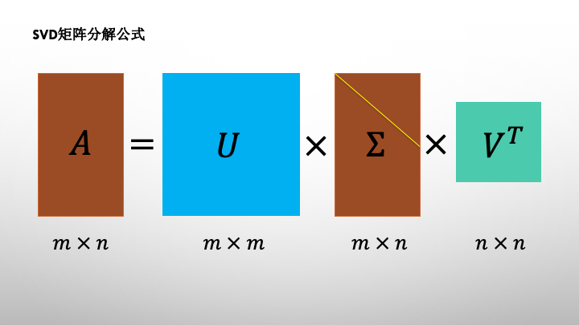
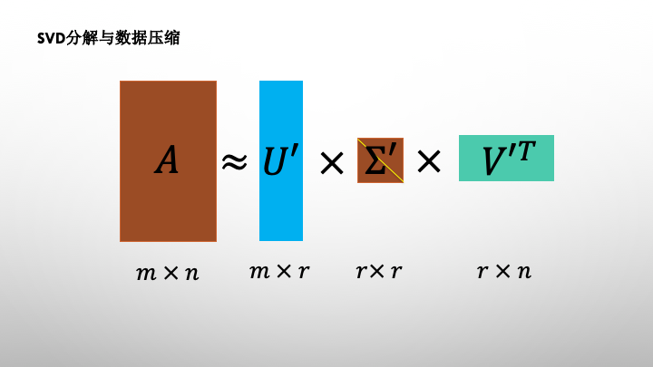
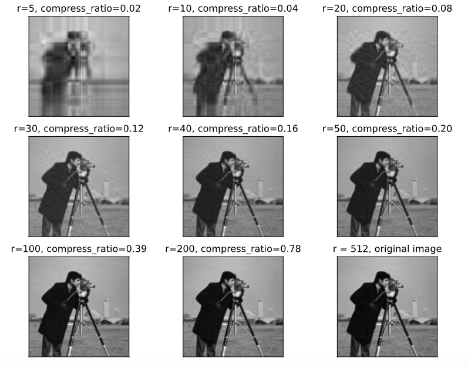
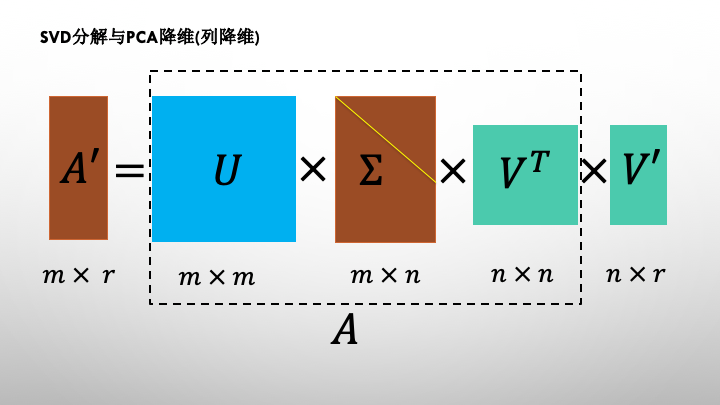
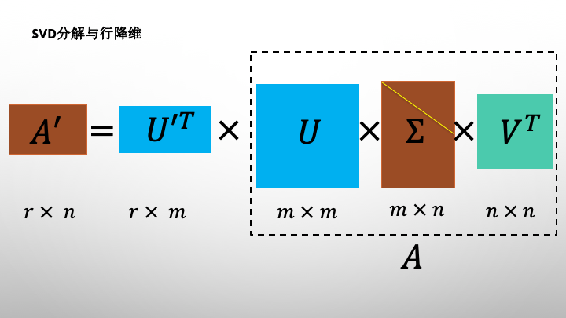

# 30分钟学会SVD奇异值分解


SVD(Singular Value Decomposition)奇异值分解分解是机器学习中最重要的矩阵分解方法。

它能够将一个任意形状的矩阵$A$分解成一个正交矩阵$U$和一个对角矩阵$\Sigma$以及另一个正交矩阵$V^T$的乘积。

SVD分解具有非常深刻的几何含义。矩阵实际上对应着一种线性变换，一个矩阵作用到一个向量上，会得到一个新的向量。任何一个矩阵$A$的操作效果可以分解成一次旋转$V^T$，一次拉伸和维度改变$\Sigma $，以及另外一次旋转$U$三者作用效果的合成。

SVD分解通常用于数据压缩和数据降维。用于数据降维时，既可以对列降维，也可以对行降维，其中对列的降维等价于PCA的降维。

不仅如此，SVD算法还可以用于在声音和图像处理中剥离背景信号，在推荐算法中也经常出现它的身影。

### 一，SVD矩阵分解简介


SVD分解将任意矩阵$A$分解成一个正交矩阵$U$和一个对角矩阵$\Sigma$以及另一个正交矩阵$V^T$的乘积。

对角矩阵$\Sigma$的对角元称为矩阵$A$的奇异值，可以证明，奇异值总是大于等于0的。

当对角矩阵$\Sigma$的奇异值按从大到小排列时，SVD分解是唯一的。

$$A = U \Sigma V^T$$

假定$A$是$m\times n$维的，则 $U$ 是$m\times m$维的，$\Sigma$是 $m\times n$维的，$V^T$是 $n\times n$ 维的。


SVD分解有着非常深刻的几何含义。

矩阵实际上是对应着一种线性变换。一个矩阵作用到一个向量上，会得到一个新的向量。任何一个矩阵$A$的操作效果可以分解成一次旋转$V^T$，一次拉伸和维度改变$\Sigma $，以及另外一次旋转$U$三者作用效果的合成。

注意正交矩阵$V^T$和$U$作用到向量后是不会改变向量长度的，所以对应着旋转变换。




```python

```

### 二，SVD分解的数学推演


$A = U \Sigma V^T$  可以推出

$A A^T = (U \Sigma V^T)(V \Sigma^T U^T) = U(\Sigma\Sigma^T)U^T $

$U^TA A^TU = \Sigma\Sigma^T$

$\Sigma\Sigma^T$ 依然是对角矩阵，又U为正交矩阵。

所以 $(\Sigma\Sigma^T)$为$A A^T$的相似对角矩阵，其对角元为 $A A^T$的特征值，U由其对应特征向量构成，这些向量称为A的左奇异向量。

因此$\Sigma$的对角元为$A A^T$特征值的平方根，称之为矩阵A的奇异值。

类似地$V$由$A^TA$的特征向量构成，这些向量称为A的右奇异向量。

```python

```

### 三，SVD分解和数据压缩


奇异值描述了矩阵对应的拉伸变换在各个方向的比例，是矩阵的重要特征。

奇异值的分布通常非常不均，在很多的情况下前10%甚至1%的奇异值之和就占了全部奇异值之和的99%以上。

因此我们可以用前$r$个大的奇异值来近似的描述矩阵。$(r<<min(m,n))$

这就是SVD分解用来进行数据压缩的原理。





假设 m = 10000,n = 8000,原来存储矩阵A需要存储8000万个数字，如果经过奇异值分解发现前100个奇异值贡献了99%的奇异值之和，于是可以近似只保留这100个奇异值及对应的左右奇异向量，那么只需要保留100+10000×100+100×8000= 180.01万个数字，只有原来的不到2.3%。


```python
# 下面的范例示范SVD分解用于图片数据压缩。
%matplotlib inline 
%config InlineBackend.figure_format = 'svg'
import numpy as np 
from matplotlib import pyplot as plt
from skimage import data

def compressBySVD(img,r):
    u,s,vt = np.linalg.svd(img)
    ur = u[:,0:r]
    sr = s[0:r]
    vtr = vt[0:r,:]
    return (ur,sr,vtr)

def rebuildFromSVD(ur,sr,vtr):
    img = ur@np.diag(sr)@vtr
    return(img)


img = data.camera()/255.0

plt.figure(figsize=(10,8)) 
for i,r in enumerate([5,10,20,30,40,50,100,200],start = 1):
    ur,sr,vtr = compressBySVD(img,r)
    compress_ratio = (np.product(ur.shape) + len(sr) + 
                      np.product(vtr.shape))/np.product(img.shape)
    img_rebuild = rebuildFromSVD(ur,sr,vtr)
    ax=plt.subplot(3,3,i)
    ax.imshow(img_rebuild,cmap = "gray")
    ax.set_title("r=%d"%r+", compress_ratio=%.2f"%compress_ratio)
    ax.set_xticks([])
    ax.set_yticks([]) 
    
ax = plt.subplot(3,3,9)
ax.imshow(img,cmap = "gray")
ax.set_title("r = 512, original image")
ax.set_xticks([])
ax.set_yticks([]) 

plt.show()


```



```python

```

### 四，SVD分解和PCA降维


PCA降维可以看成是SVD分解的一个应用。PCA降维使用的变换矩阵恰好是SVD分解的右奇异矩阵$V$。

实际上，由于SVD分解存在着无需通过计算特征值和特征向量的可并行的数值迭代计算算法，sklearn的PCA降维算法正是通过SVD分解计算的。





下面证明SVD分解的右奇异向量构成的矩阵$V$恰好是PCA算法所需要的正交变换矩阵$W$。

假定PCA对应的正交变换矩阵为$W$，根据PCA算法的数学原理，

$W$由协方差矩阵$(X - \overline{X})^T(X - \overline{X})$ 的各个特征向量组成，它能够将协方差矩阵相似对角化。

$$W^T(X - \overline{X})^T(X - \overline{X})W = \Lambda$$

其中$\Lambda$为$(X - \overline{X})^T(X - \overline{X})$的相似对角矩阵，且对角元由大到小排列。

利用$X - \overline{X}$的SVD矩阵分解:

$$X - \overline{X} = U \Sigma V^T$$ 

我们有

$$V^T(X - \overline{X})^T(X - \overline{X})V = \Sigma^T\Sigma $$ 

根据SVD分解的数学原理，$\Sigma^T\Sigma$也是 $(X - \overline{X})^T(X - \overline{X})$的相似对角矩阵，且对角元由大到小排列。

于是有：

$$\Sigma^T\Sigma = \Lambda $$

$$V^T(X - \overline{X})^T(X - \overline{X})V =  \Lambda $$ 

于是右奇异向量构成的矩阵 𝑉 恰好是PCA算法所需要的正交变换矩阵 𝑊。

$$W = V$$

注意到PCA算法实际上是一种列降维的方法，实际上利用SVD分解的左奇异矩阵$U$也可以对矩阵进行行降维。




```python
# 演示SVD用于PCA降维的计算

%matplotlib inline 
%config InlineBackend.figure_format = 'svg'
import numpy as np 
from sklearn.decomposition import PCA

from matplotlib import pyplot as plt
from skimage import data

X = np.array([[-1.0, -3, -2], [-2, -1, -3], [-3, -2, -5], [2, 1, 3], [6, 1, 3], [2, 2, 3]])

pca = PCA(n_components= 2)
X_new = pca.fit_transform(X)
print("\ndecomposition by pca:")
print("singular value:")
print(pca.singular_values_)
print("X_new:")
print(X_new)

print("\ndecomposition by svd:")
U,S,Vt = np.linalg.svd(X-X.mean(axis = 0))
print("singular value:\n",S[:2])
print("X_new:")
print(np.dot(X-X.mean(axis = 0),np.transpose(Vt)[:,0:2]))

# 注：降维结果中正负号的差异是因为PCA调整了SVD分解后的U和Vt符号以保持各列最大值取正
```

```
decomposition by pca:
singular value:
[11.31375337  2.89544001]
X_new:
[[ 3.23378083  1.06346839]
 [ 3.88607412 -0.50763321]
 [ 6.25267378  0.08479886]
 [-3.50509914 -0.96584476]
 [-6.02398361  1.89494314]
 [-3.84344598 -1.56973242]]

decomposition by svd:
singular value:
 [11.31375337  2.89544001]
X_new:
[[-3.23378083 -1.06346839]
 [-3.88607412  0.50763321]
 [-6.25267378 -0.08479886]
 [ 3.50509914  0.96584476]
 [ 6.02398361 -1.89494314]
 [ 3.84344598  1.56973242]]
```


如果对本文内容理解上有需要进一步和作者交流的地方，欢迎在公众号"Python与算法之美"下留言。作者时间和精力有限，会酌情予以回复。

也可以在公众号后台回复关键字：加群，加入读者交流群和大家讨论。


