# 30分钟学会XGBoost


### 一，xgboost和GBDT


xgboost是一种集成学习算法，属于3类常用的集成方法(bagging,boosting,stacking)中的boosting算法类别。它是一个加法模型，基模型一般选择树模型，但也可以选择其它类型的模型如逻辑回归等。

xgboost属于梯度提升树(GBDT)模型这个范畴，GBDT的基本想法是让新的基模型（GBDT以CART分类回归树为基模型）去拟合前面模型的偏差，从而不断将加法模型的偏差降低。

相比于经典的GBDT，xgboost做了一些改进，从而在效果和性能上有明显的提升（划重点面试常考）。

第一，GBDT将目标函数泰勒展开到一阶，而xgboost将目标函数泰勒展开到了二阶。保留了更多有关目标函数的信息，对提升效果有帮助。

第二，GBDT是给新的基模型寻找新的拟合标签（前面加法模型的负梯度），而xgboost是给新的基模型寻找新的目标函数（目标函数关于新的基模型的二阶泰勒展开）。

第三，xgboost加入了和叶子权重的L2正则化项，因而有利于模型获得更低的方差。

第四，xgboost增加了自动处理缺失值特征的策略。通过把带缺失值样本分别划分到左子树或者右子树，比较两种方案下目标函数的优劣，从而自动对有缺失值的样本进行划分，无需对缺失特征进行填充预处理。

此外，xgboost还支持候选分位点切割，特征并行等，可以提升性能。

```python

```

### 二，xgboost原理概述


下面从假设空间，目标函数，优化算法3个角度对xgboost的原理进行概括性的介绍。


**1, 假设空间**

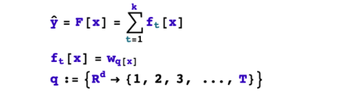

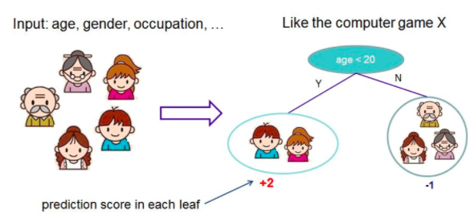
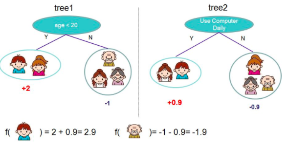

**2, 目标函数**

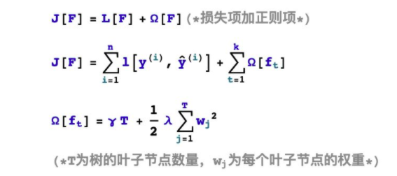
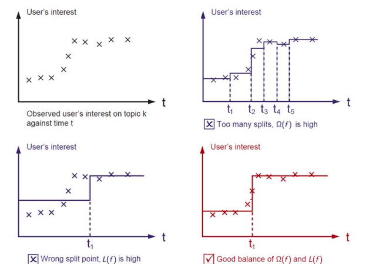

**3, 优化算法**

基本思想：贪心法，逐棵树进行学习，每棵树拟合之前模型的偏差。


```python

```

### 三，第t棵树学什么？

<!-- #region -->
要完成构建xgboost模型，我们需要确定以下一些事情。


1，如何boost? 如果已经得到了前面t-1棵树构成的加法模型，如何确定第t棵树的学习目标？


2，如何生成树？已知第t棵树的学习目标的前提下，如何学习这棵树？具体又包括是否进行分裂？选择哪个特征进行分裂？选择什么分裂点位？分裂的叶子节点如何取值？


我们首先考虑如何boost的问题，顺便解决分裂的叶子节点如何取值的问题。

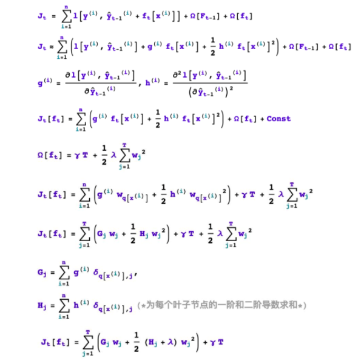
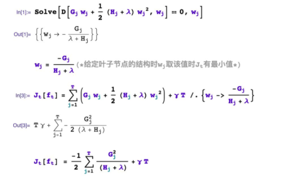
<!-- #endregion -->

```python

```

### 四，如何学习第t棵树？

<!-- #region -->
xgboost采用二叉树，开始的时候，全部样本都在一个叶子节点上。然后叶子节点不断通过二分裂，逐渐生成一棵树。

xgboost使用levelwise的生成策略，即每次对同一层级的全部叶子节点尝试进行分裂。

对叶子节点分裂生成树的过程有几个基本的问题：是否要进行分裂？选择哪个特征进行分裂？在特征的什么点位进行分裂？以及分裂后新的叶子上取什么值？

叶子节点的取值问题前面已经解决了。我们重点讨论几个剩下的问题。


**1，是否要进行分裂？**


根据树的剪枝策略的不同，这个问题有两种不同的处理。如果是预剪枝策略，那么只有当存在某种分裂方式使得分裂后目标函数发生下降，才会进行分裂。

但如果是后剪枝策略，则会无条件进行分裂，等树生成完成后，再从上而下检查树的各个分枝是否对目标函数下降产生正向贡献从而进行剪枝。

xgboost采用预剪枝策略，只有分裂后的增益大于0才会进行分裂。

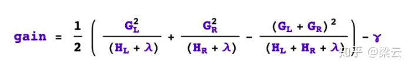


**2，选择什么特征进行分裂？**


xgboost采用特征并行的方法进行计算选择要分裂的特征，即用多个线程，尝试把各个特征都作为分裂的特征，找到各个特征的最优分割点，计算根据它们分裂后产生的增益，选择增益最大的那个特征作为分裂的特征。


**3，选择什么分裂点位？**


xgboost选择某个特征的分裂点位的方法有两种，一种是全局扫描法，另一种是候选分位点法。


全局扫描法将所有样本该特征的取值按从小到大排列，将所有可能的分裂位置都试一遍，找到其中增益最大的那个分裂点，其计算复杂度和叶子节点上的样本特征不同的取值个数成正比。


而候选分位点法是一种近似算法，仅选择常数个（如256个）候选分裂位置，然后从候选分裂位置中找出最优的那个。

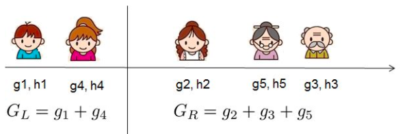
<!-- #endregion -->

```python

```

### 五，xgboost使用范例


以下为xgboost的使用范例，

```python
import numpy as np
import pandas as pd
import xgboost as xgb
import datetime
from sklearn import datasets
from sklearn.model_selection import train_test_split
from sklearn.metrics import accuracy_score

def printlog(info):
    nowtime = datetime.datetime.now().strftime('%Y-%m-%d %H:%M:%S')
    print("\n"+"=========="*8 + "%s"%nowtime)
    print(info+'...\n\n')
    
    
#================================================================================
# 一，读取数据
#================================================================================
printlog("step1: reading data...")

# 读取dftrain,dftest
breast = datasets.load_breast_cancer()
df = pd.DataFrame(breast.data,columns = [x.replace(' ','_') for x in breast.feature_names])
df['label'] = breast.target
dftrain,dftest = train_test_split(df)

xgb_train = xgb.DMatrix(dftrain.drop("label",axis = 1),dftrain[["label"]])
xgb_valid = xgb.DMatrix(dftest.drop("label",axis = 1),dftest[["label"]])

#================================================================================
# 二，设置参数
#================================================================================
printlog("step2: setting parameters...")
                               
num_boost_round = 100                   
early_stopping_rounds = 20

# 配置xgboost模型参数
params_dict = dict()

# booster参数
params_dict['learning_rate'] = 0.05      # 学习率，通常越小越好。
params_dict['objective'] = 'binary:logistic'

# tree参数
params_dict['max_depth'] = 3              # 树的深度，通常取值在[3,10]之间
params_dict['min_child_weight']= 30       # 最小叶子节点样本权重和，越大模型越保守。
params_dict['gamma']= 0                   # 节点分裂所需的最小损失函数下降值，越大模型越保守。
params_dict['subsample']= 0.8             # 横向采样，样本采样比例，通常取值在 [0.5，1]之间 
params_dict['colsample_bytree'] = 1.0     # 纵向采样，特征采样比例，通常取值在 [0.5，1]之间 
params_dict['tree_method'] = 'hist'       # 构建树的策略,可以是auto, exact, approx, hist

# regulazation参数 
# Omega(f) = gamma*T + reg_alpha* sum(abs(wj)) + reg_lambda* sum(wj**2)  
params_dict['reg_alpha'] = 0.0            #L1 正则化项的权重系数，越大模型越保守，通常取值在[0,1]之间。
params_dict['reg_lambda'] = 1.0           #L2 正则化项的权重系数，越大模型越保守，通常取值在[1,100]之间。

# 其他参数
params_dict['eval_metric'] = 'auc'
params_dict['silent'] = 1
params_dict['nthread'] = 2
params_dict['scale_pos_weight'] = 1       #不平衡样本时设定为正值可以使算法更快收敛。
params_dict['seed'] = 0


#================================================================================
# 三，训练模型
#================================================================================
printlog("step3: training model...")


result = {}
watchlist = [(xgb_train, 'train'),(xgb_valid,'valid')] 

bst = xgb.train(params = params_dict, dtrain = xgb_train, 
                num_boost_round = num_boost_round, 
                verbose_eval= 1,
                evals = watchlist,
                early_stopping_rounds=early_stopping_rounds,
                evals_result = result)


#================================================================================
# 四，评估模型
#================================================================================
printlog("step4: evaluating model ...")


y_pred_train = bst.predict(xgb_train, ntree_limit=bst.best_iteration)
y_pred_test = bst.predict(xgb_valid, ntree_limit=bst.best_iteration)

print('train accuracy: {:.5} '.format(accuracy_score(dftrain['label'], y_pred_train>0.5)))
print('valid accuracy: {:.5} \n'.format(accuracy_score(dftest['label'], y_pred_test>0.5)))

%matplotlib inline
%config InlineBackend.figure_format = 'svg'

dfresult = pd.DataFrame({(dataset+'_'+feval): result[dataset][feval] 
               for dataset in ["train","valid"] for feval in ['auc']})

dfresult.index = range(1,len(dfresult)+1) 
ax = dfresult.plot(kind='line',figsize=(8,6),fontsize = 12,grid = True) 
ax.set_title("Metric During Training",fontsize = 12)
ax.set_xlabel("Iterations",fontsize = 12)
ax.set_ylabel("auc",fontsize = 12)


ax = xgb.plot_importance(bst,importance_type = "gain",xlabel='Feature Gain')
ax.set_xlabel("Feature Gain",fontsize = 12)
ax.set_ylabel("Features",fontsize = 12)
fig = ax.get_figure() 
fig.set_figwidth(8)
fig.set_figheight(6)

#================================================================================
# 五，保存模型
#================================================================================
printlog("step5: saving model ...")
model_dir = "data/bst.model"
print("model_dir: %s"%model_dir)
bst.save_model(model_dir)
bst_loaded = xgb.Booster(model_file=model_dir)

printlog("task end...")

```

```
================================================================================2020-07-26 19:35:37
step1: reading data......


================================================================================2020-07-26 19:35:37
step2: setting parameters......


================================================================================2020-07-26 19:35:37
step3: training model......


[0]	train-auc:0.918548	valid-auc:0.918019
Multiple eval metrics have been passed: 'valid-auc' will be used for early stopping.

Will train until valid-auc hasn't improved in 20 rounds.
[1]	train-auc:0.924606	valid-auc:0.923221
[2]	train-auc:0.964304	valid-auc:0.973991
[3]	train-auc:0.964304	valid-auc:0.973991
[4]	train-auc:0.969323	valid-auc:0.982522
[5]	train-auc:0.969323	valid-auc:0.982522
[6]	train-auc:0.969323	valid-auc:0.982522
[7]	train-auc:0.970055	valid-auc:0.982522
[8]	train-auc:0.972192	valid-auc:0.983874
[9]	train-auc:0.972912	valid-auc:0.98377
[10]	train-auc:0.973597	valid-auc:0.984394
[11]	train-auc:0.972912	valid-auc:0.98377
[12]	train-auc:0.972771	valid-auc:0.983146
[13]	train-auc:0.972818	valid-auc:0.983458
[14]	train-auc:0.973644	valid-auc:0.983666
[15]	train-auc:0.973881	valid-auc:0.983458
[16]	train-auc:0.973739	valid-auc:0.983666
[17]	train-auc:0.976195	valid-auc:0.983562
[18]	train-auc:0.976431	valid-auc:0.983562
[19]	train-auc:0.976289	valid-auc:0.98273
[20]	train-auc:0.976195	valid-auc:0.98273
[21]	train-auc:0.981816	valid-auc:0.986579
[22]	train-auc:0.981816	valid-auc:0.986579
[23]	train-auc:0.981816	valid-auc:0.986579
[24]	train-auc:0.981792	valid-auc:0.986579
[25]	train-auc:0.981839	valid-auc:0.986371
[26]	train-auc:0.981839	valid-auc:0.986371
[27]	train-auc:0.981839	valid-auc:0.986371
[28]	train-auc:0.981839	valid-auc:0.986371
[29]	train-auc:0.981839	valid-auc:0.986371
[30]	train-auc:0.981839	valid-auc:0.986371
[31]	train-auc:0.981839	valid-auc:0.986371
[32]	train-auc:0.981839	valid-auc:0.986371
[33]	train-auc:0.981839	valid-auc:0.986371
[34]	train-auc:0.981839	valid-auc:0.986371
[35]	train-auc:0.981839	valid-auc:0.986371
[36]	train-auc:0.981839	valid-auc:0.986371
[37]	train-auc:0.981839	valid-auc:0.986371
[38]	train-auc:0.981839	valid-auc:0.986371
[39]	train-auc:0.981839	valid-auc:0.986371
[40]	train-auc:0.981839	valid-auc:0.986371
[41]	train-auc:0.981839	valid-auc:0.986371
Stopping. Best iteration:
[21]	train-auc:0.981816	valid-auc:0.986579


================================================================================2020-07-26 19:35:37
step4: evaluating model ......


train accuracy: 0.94131 
valid accuracy: 0.90909 


================================================================================2020-07-26 19:35:37
step5: saving model ......


model_dir: data/bst.model

================================================================================2020-07-26 19:35:37
task end......
```


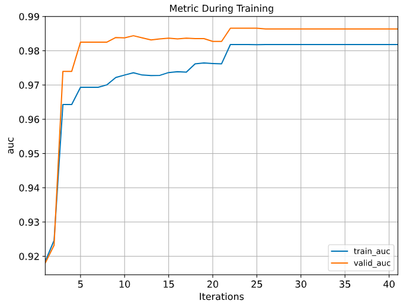
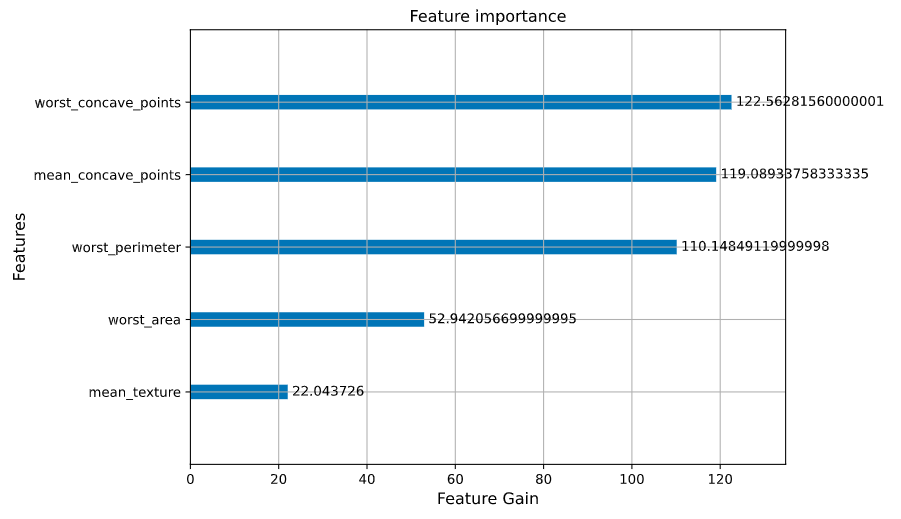

```python

```
