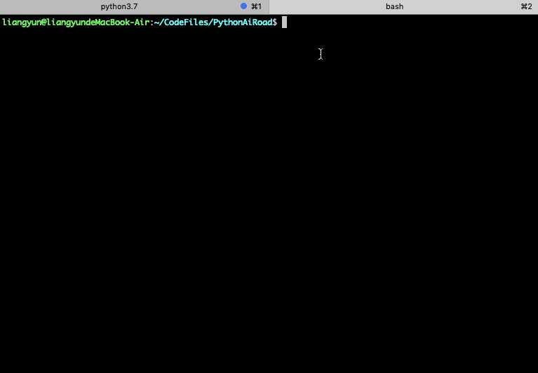

### Linux环境下批量执行队列任务的优雅方案


设想我们有一个程序，需要在不同的参数下执行很多次，我们希望能够批量进行提交。

但是程序对系统的资源消耗比较大，而系统的资源是有限。

我们希望这些任务是按照队列排队提交的，每次只执行3个。

只有当队列中有的程序执行完了，后面的配备了其他参数程序才会继续执行。

在Linux环境下，我们可以用FIFO管道控制多进程任务来实现这个功能。

这种使用场景在数据挖掘相关的业务中是非常普遍的。

例如需要批量提交spark任务来对不同城市的业务数据进行挖掘，但由于计算资源有限，最好控制每次只执行几个任务。


### 一，任务脚本


下面是一个玩具Python代码，从参数中读取城市和日期信息，在该城市该日期参数下进行数据挖掘！！！😊

```python
%%writefile task.py
import sys
arg = sys.argv[1]
city,date = arg.split(" ")
print(f"data mining task@{city}, date={date}")

```

```python
!python task.py "北京 20200101"
```

### 二，提交脚本 


下面使用bash脚本批量提交数据挖掘任务。

注意使用THREAD_NUM参数来控制并行执行的任务数量。

这个脚本的关键有三处：

一是使用字符串分割转换成数组来获取参数列表。

二是使用Linux中的&符号开启多进程任务并行执行不同参数的任务。

三是使用FIFO管道在进程间通信来控制并行的任务数量。


```python
%%writefile a_lot_jobs.sh
#!/bin/bash

#允许同时跑的任务数为THREAD_NUM
THREAD_NUM=3 #todo: revise me 

args="""
北京 20200101
上海 20200202
深圳 20200303
广州 20200404
南京 20201001
天津 20200901
武汉 20201101
南昌 20200809
成都 20200901
""" #todo: revise me

#指定分隔符
IFS='
'
array=(${args})

#定义描述符为9的FIFO管道
mkfifo tmp
exec 9<>tmp
rm -f tmp

#预先写入指定数量的空格符，一个空格符代表一个进程
for ((i=0;i<$THREAD_NUM;i++))
do
    echo >&9
done

for arg in ${array[@]}; do
  #控制进程数：读出一个空格字符，如果管道为空，此处将阻塞
  read -u9
  {
     #打印参数 
     #echo ${arg} 
     #此行代码指定任务提交方法
     python task.py ${arg} #todo : revise me!
     #每执行完一个程序，睡眠3s
     sleep 3
     #控制进程数：一个任务完成后，写入一个空格字符到管道，新的任务将可以执行
     echo >&9
  }&
done
wait
echo "全部任务执行结束"
```

```python
!sh a_lot_jobs.sh
```



```python

```

```python

```
